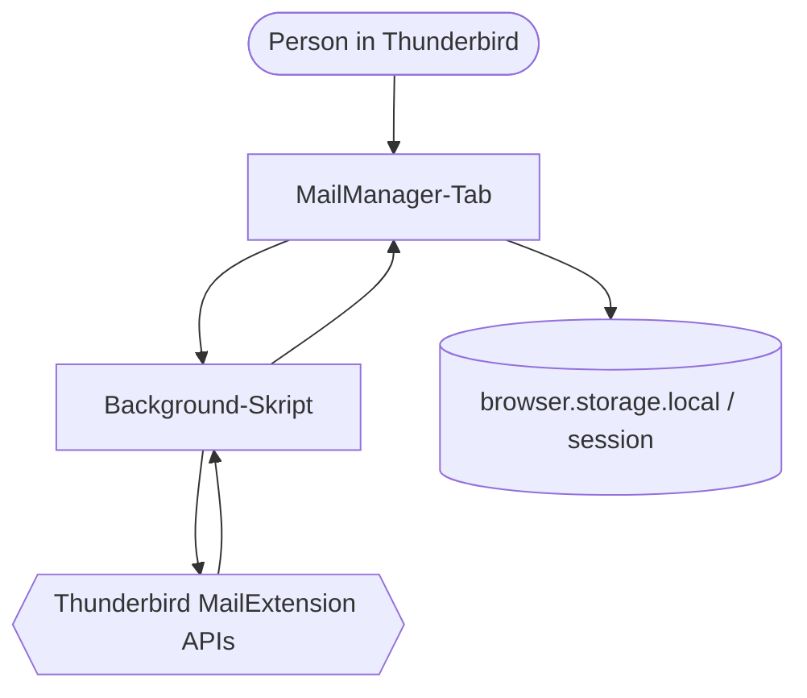

# MailManager


MailManager ist ein lokales Thunderbird-Add-on zum Prüfen und Aufräumen großer Postfächer. Es scannt ausgewählte Ordner, fasst Nachrichten nach Absender oder Domain zusammen und lässt dich die Auswahl vor einer Aktion kontrollieren. Das Add-on arbeitet im Thunderbird-Profil: kein eigener Server, keine Cloud-Synchronisation, kein Tracking und keine Telemetrie.

> **Status: Beta, Version 0.3.0-beta.** Sichere Funktionen ersetzen kein Backup. Vor dem Einsatz mit wichtigen Mails zuerst ein Backup anlegen und den Ablauf in einem unkritischen Ordner testen. Reale Thunderbird-Integrationstests stehen noch aus.

## Inhalt

- [Was ist MailManager?](#was-ist-mailmanager)
- [Warum gibt es diese Schutzmechanismen?](#warum-gibt-es-diese-schutzmechanismen)
- [Wann passt MailManager?](#wann-passt-mailmanager)
- [Alternativen und Grenzen](#alternativen-und-grenzen)
- [So funktioniert der Ablauf](#so-funktioniert-der-ablauf)
- [Architektur und Projektkarte](#architektur-und-projektkarte)
- [Installation und Entwicklung](#installation-und-entwicklung)
- [Berechtigungen, Datenschutz und Lizenz](#berechtigungen-datenschutz-und-lizenz)

## Was ist MailManager?

MailManager hilft beim Aufräumen, nicht beim automatischen Löschen. Ein Scan liest Nachrichten-Metadaten aus Thunderbird und bildet daraus Absender- und Domain-Gruppen. Für jede Gruppe zeigt die Oberfläche unter anderem Anzahl, Größe, Lesequote, älteste und neueste Nachricht sowie Beispiel-Betreffe. Einzelne Mails lassen sich aufklappen, prüfen und auswählen.

### Was die Oberfläche bietet

- **Quellauswahl und Scan-Profile**: ein Konto, ein Ordner oder alle nicht systemeigenen Ordner; Vollscan, nur Mails älter als ein Jahr, nur Newsletter/Bulk, nur ungelesene Mails oder Aufräum-Kandidaten.
- **Drei-Spalten-Arbeitsbereich**: Filter in der Sidebar, die Absenderliste in der Mitte und ein Detailbereich für den ausgewählten Absender.
- **Absender- und Domainansicht**: Absender vergleichen oder zusammengehörige Domains bündeln; Sortierung nach Aufräum-Score, Anzahl, Größe, Alter, Aktivität oder A–Z.
- **Smart-Cleanup-Dashboard**: Karten unter „Aufräumvorschläge“ zeigen Newsletter/Bulk, speicherintensive Absender und seit mehr als zwei Jahren inaktive Absender. Jede Karte kann ihre Treffer filtern oder auswählen.
- **Filter und Kandidatenprüfung**: Die Sidebar gruppiert Schnellfilter unter VIEW, RECOMMENDED, CRITERIA und UNSUBSCRIBE. Filter-Pills grenzen die Liste ein; Aktionen über die volle Breite prüfen Abmeldelinks und starten die Sammelabmeldung. Erweiterte Filter lassen sich für Größe, Alter/Aktivität und Lesestatus kombinieren.
- **Nachrichtenprüfung**: Absender lassen sich in Nachrichtenzeilen aufklappen. Diese werden neueste zuerst in Seiten zu 50 Nachrichten geladen. Die Inline-Vorschau extrahiert einen kurzen Klartext-Auszug; Anhänge lassen sich öffnen oder speichern.
- **Aktionen**: Auswahl in den Papierkorb oder einen bestehenden bzw. neuen Ordner verschieben, als gelesen markieren, Thunderbird-Tags setzen, Abmeldeinformationen prüfen sowie Scan-Daten als CSV oder JSON exportieren. Mehrere Absender lassen sich mit einem Schritt abmelden: `https:`-Links öffnen im Browser, `mailto:`-Links ein vorbefülltes Verfassen-Fenster.
- **Lokale Verwaltung**: Aufräum-Regeln, Schutzliste, Aktionsprotokoll, Diagnoseansicht, sichtbare Spalten und eigene RegEx-Regeln für Markierungen.
- **Bedienung**: Kontextmenüs, Tastaturnavigation in aufgeklappten Nachrichtenlisten, Bereichsauswahl mit Umschalt-Klick und Drag-and-drop in einen Zielordner.
- **Darstellung und Sprachen**: helles und dunkles Farbschema, SVG-Icons in der Oberfläche sowie Übersetzungen für Deutsch, Englisch und Russisch über die gemeinsame `_()`-Funktion.

### Aufräum-Score und Bulk-Erkennung

Der Aufräum-Score von 0 bis 100 ist ein Hinweis für die Prüfung, kein Spam- oder Sicherheitsurteil. Er gewichtet Mail-Volumen, Ungelesen-Rate und Inaktivität. Ein hoher Score heißt deshalb: Diese Gruppe ist vermutlich ein lohnender Kandidat für einen Blick, nicht dass sie sicher gelöscht werden darf.

Die Bulk-Erkennung betrachtet typische Newsletter- und Marketingmuster in Adresse, Anzeigename und Beispiel-Betreff. Sie erkennt außerdem `List-Unsubscribe`-Header auf Anfrage. Die Suche für diese Muster ist diakritika-insensitiv, also etwa bei `ä`/`a` oder `ß`/`ss`. Eigene RegEx-Regeln können zusätzliche Muster wie `amazon|ebay` markieren.

## Warum gibt es diese Schutzmechanismen?

Mailbox-Aufräumen hat eine unangenehme Eigenschaft: Ein Treffer kann hundert Nachrichten bedeuten, und eine falsche Auswahl kann schwer zu bemerken sein. MailManager hält deshalb Analyse, Vorschau und Aktion getrennt.

### Schutz vor der Aktion

- Systemordner wie Gesendet, Entwürfe, Archiv, Papierkorb, Spam/Junk und Postausgang werden nicht als Scan-Ziel angeboten.
- Geschützte Absender und geschützte Quellordner werden im Background vor Papierkorb-, Verschiebe-, Archiv- und Tag-Aktionen erneut geprüft. Fehlen verlässliche Ordnerdaten, schlägt die Aktion fehl, statt zu raten.
- Der Papierkorb-Dialog berechnet vorab Anzahl, Größe und durch Regeln ausgesparte Nachrichten. Nach einer Regeländerung bleibt die Bestätigung gesperrt, bis eine neue Vorschau vorliegt.
- Warnungen decken unter anderem sehr neue Mails, persönliche Absender, kleine Gruppen, überwiegend gelesene Auswahl, große Mengen und gemischte Domains ab. Bei hohen Warnungen ist eine zusätzliche Bestätigung nötig.
- Gespeicherte Regeln können nur ältere Mails berücksichtigen und pro Absender die neuesten *N* Nachrichten behalten.
- Der normale Aufräumfluss verschiebt in den Papierkorb. Eine öffentlich erreichbare Aktion zum permanenten Löschen wird nicht angeboten und die Berechtigung `messagesDelete` wird nicht angefordert.
- Beim Verschieben funktioniert Rückgängig nur, wenn Thunderbird neue Message-IDs zurückliefert. Bei Tags und Lesestatus stellt es den gespeicherten Zustand wieder her; die Undo-Einträge sind pro MailManager-Tab getrennt.
- CSV-Export escaped Anführungszeichen und neutralisiert Formelpräfixe in Absenderfeldern, damit ein Tabellenprogramm sie nicht als Formeln ausführt.

### Warum lokal?

Der sensible Teil einer Mailbox ist nicht nur der Nachrichtentext. Schon Absender, Betreffe, Größen und Zeitpunkte sagen viel aus. MailManager verarbeitet diese Daten innerhalb von Thunderbird. `browser.storage.local` speichert nur MailManager-Daten wie Regeln, Schutzliste, Protokoll und UI-Einstellungen. Der Scan-Cache liegt in `browser.storage.session`; nach einem Thunderbird-Neustart ist ein neuer Scan nötig. Exportdateien entstehen nur nach einer ausdrücklichen Exportaktion.

Eine `https:`-Abmelde-URL wird erst nach Bestätigung im Standardbrowser geöffnet. Bei `mailto:` öffnet MailManager nur ein vorbefülltes Thunderbird-Verfassen-Fenster.

## Wann passt MailManager?

MailManager passt, wenn ein Postfach über Jahre gewachsen ist und du die Auswahl nachvollziehbar eingrenzen willst: Newsletter prüfen, inaktive Absender finden, Speicherverbrauch vergleichen oder alte Mails nach klaren Regeln in den Papierkorb verschieben.

Ein sinnvoller Ablauf sieht so aus:

1. Konto, Ordner oder alle nicht systemeigenen Ordner und ein Scan-Profil wählen.
2. Scan starten und Kandidaten mit Suche, Sortierung, Schnellfiltern oder dem Dashboard eingrenzen.
3. Verdächtige Absender aufklappen, einzelne Nachrichten per Vorschau oder in Thunderbird prüfen und wichtige Absender schützen.
4. Auswahl in den Papierkorb-Dialog übernehmen. Regeln wie "älter als 365 Tage" und "die letzten 5 behalten" setzen.
5. Die automatisch berechnete Vorschau und Sicherheitswarnungen prüfen. Nach Änderungen die Vorschau erneut berechnen.
6. Erst dann bestätigen, Ergebnis und Aktionsprotokoll kontrollieren und bei verfügbarem Undo sofort zurücknehmen.

Die Schutzvorschläge richten sich unter anderem nach persönlichen, kürzlich aktiven oder kleinen Absendergruppen sowie einer hohen Lesequote. Sie sind Vorschläge, keine automatische Klassifikation.

### Wann nicht?

- Nicht als Ersatz für ein Backup oder für eine eigene Archivierungsstrategie.
- Nicht für unbeaufsichtigtes Massenlöschen: Score, Bulk-Erkennung und `List-Unsubscribe` sind heuristisch und können falsch liegen.
- Ein lokal gebautes XPI mit der permanenten ID in `manifest.json` kann direkt über den Thunderbird-Add-ons-Manager installiert werden. Für die öffentliche Verteilung ist eine Einreichung und Prüfung über [addons.thunderbird.net](https://addons.thunderbird.net) nötig.
- Nicht als vollständiger Mail-Client: Vollständiges Lesen, Bearbeiten und Antworten bleiben Aufgaben von Thunderbird.

## Alternativen und Grenzen

| Bedarf | MailManager | Alternative |
|---|---|---|
| Ein paar Mails einzeln entfernen | Gruppiert und prüft Auswahl vor der Aktion | Direkt in Thunderbird löschen oder verschieben |
| Newsletter künftig vermeiden | Erkennt mögliche Bulk-Absender und `List-Unsubscribe` | Beim jeweiligen Absender abmelden oder Thunderbird-Filter verwenden |
| Alte Nachrichten dauerhaft aufbewahren | Kann sie in einen Ordner verschieben | Thunderbird-Archivierung oder eigene IMAP-Archivordner |
| Mailbox ohne Prüfung leeren | Nicht der Zweck des normalen Aufräumflusses | Nur nach Backup und mit der jeweiligen Thunderbird-Funktion |
| Dauerhaft installierbares Add-on | Lokal gebautes XPI mit permanenter ID über den Add-ons-Manager installieren | Für öffentliche Verteilung [addons.thunderbird.net](https://addons.thunderbird.net/) nutzen |

Bekannte Grenzen:

- Thunderbird kann Message-IDs beim Verschieben ändern; damit hängt die Zuverlässigkeit von Undo an den von Thunderbird zurückgemeldeten IDs.
- Die Inline-Vorschau zeigt nur einen gekürzten Klartext-Auszug. HTML wird nur als Fallback vereinfacht, nicht als vollständige Nachricht gerendert.
- Die Abmeldeprüfung läuft erst bei Bedarf, damit der reguläre Scan nicht unnötig mehr liest.
- Scan-, Verschiebe-, Undo-, Vorschau-, Abmelde- und Anhangsabläufe müssen zusätzlich in einem laufenden Thunderbird geprüft werden.

## Architektur und Projektkarte

### So funktioniert der Ablauf



1. Der Toolbar-Button öffnet `tab/tab.html` in einem eigenen Thunderbird-Tab.
2. `tab/tab.js` fragt Konten und Ordner an, startet Scans und hält den UI-Zustand der aktuellen Ansicht.
3. `background/background.js` spricht mit den Thunderbird-APIs, liest Ordner und Nachrichten, prüft Schutzgrenzen und führt bestätigte Aktionen aus.
4. Die testbaren Funktionen in `shared/` berechnen Scores, normalisieren Domains, formatieren Exporte und gewinnen Vorschautext.
5. Der Tab zeigt Ergebnis, Vorschau und Warnungen. Erst eine gültige Vorschau erlaubt die Papierkorb-Bestätigung.

### Die entscheidenden Dateien

| Pfad | Wofür er da ist |
|---|---|
| [`mailmanager/manifest.json`](mailmanager/manifest.json) | Manifest V3, feste Erweiterungs-UUID, Autor, SVG-/PNG-Icons, Mindestversion Thunderbird 150.0, Berechtigungen und Background-Einstiegspunkt |
| [`mailmanager/background/background.js`](mailmanager/background/background.js) | Nachrichtenrouter, Ordner- und Scanschnittstelle, Schutzprüfung, Aktionen und Undo |
| [`mailmanager/tab/tab.js`](mailmanager/tab/tab.js) | UI-Zustand, Darstellung, Filter, Auswahl, Dialoge und Aktionserzeugung |
| [`mailmanager/shared/cleanup-logic.mjs`](mailmanager/shared/cleanup-logic.mjs) | Aufräum- und Bulk-Score, Domain-Normalisierung, Schutzvorschläge und Regelvorschläge |
| [`mailmanager/shared/message-preview.mjs`](mailmanager/shared/message-preview.mjs) | Begrenzter Klartext-Auszug aus einer Thunderbird-Nachrichtenstruktur |
| [`mailmanager/shared/utils.js`](mailmanager/shared/utils.js) | Autor-Parsing, Anzeigeformate sowie CSV- und JSON-Export |
| [`mailmanager/tests/`](mailmanager/tests/) | Node.js-Tests für Logik, Vorschau, UI-Helfer und Background-Schutzgrenzen |

Weitere Details zur Bedienung, festen Installation und Tastatursteuerung stehen in [`mailmanager/README.md`](mailmanager/README.md). Änderungen stehen im [`CHANGELOG.md`](CHANGELOG.md).

## Installation und Entwicklung

### Voraussetzungen

- Thunderbird **150.0 oder neuer**
- Node.js **20** für Tests und Paketbau; zum Ausführen des Add-ons nicht nötig
- `zip` für `npm run build`

### Temporär zum Entwickeln laden

```text
Thunderbird → ≡ → Add-ons und Themes → Erweiterungen
→ ⚙ → Add-ons debuggen → Temporäres Add-on laden…
→ mailmanager/manifest.json auswählen
```

Nach Änderungen in der Debug-Ansicht **Neu laden** wählen. Temporäre Add-ons werden beim Beenden von Thunderbird entfernt.

### Prüfen und bauen

```bash
git clone https://github.com/mrAibo/Mail_Manager.git
cd Mail_Manager/mailmanager
npm run check     # Syntaxprüfungen und 83 Unit-Tests
npm run build     # erstellt ../mailmanager.xpi
```

[`mailmanager.xpi`](mailmanager.xpi) im Repository-Root ist das kanonische Paketartefakt. [`dist/mailmanager.xpi`](dist/mailmanager.xpi) ist die mitgeführte Kopie. Der Build schließt Tests, `node_modules`, `package.json` und die Unterordner-README aus. Die CI führt `npm run check` aus, baut das XPI, prüft es mit `unzip -t` und lädt `mailmanager.xpi` als Build-Artefakt hoch.

Für ein dauerhaft installierbares XPI ist eine feste Erweiterungs-ID nötig (in `manifest.json` gesetzt). Thunderbird verlangt für die lokale Installation keine Mozilla-Signierung: Ein lokal gebautes XPI mit fester ID lässt sich über den Add-ons-Manager installieren. Für die öffentliche Verteilung das XPI über [addons.thunderbird.net](https://addons.thunderbird.net/) einreichen und veröffentlichen.

### Testabdeckung

```bash
cd mailmanager
npm test
node --check tab/tab.js
```

Die Tests decken Score-, Bulk-, Domain-, Filter-, Export- und Vorschau-Logik sowie die Schutzgrenzen im Background mit gemockten Thunderbird-APIs ab. Der aktuelle Lauf umfasst **83 Tests in 5 Testdateien**.

## Berechtigungen, Datenschutz und Lizenz

| Berechtigung | Zweck |
|---|---|
| `accountsRead` | Konten und Ordner lesen |
| `accountsFolders` | Zielordner anlegen |
| `messagesRead` | Nachrichten-Metadaten, Vorschauen und Anhänge lesen |
| `messagesMove` | Nachrichten in Papierkorb oder Ordner verschieben |
| `messagesUpdate` | Nachrichten als gelesen markieren |
| `messagesTags` | Thunderbird-Tags lesen und setzen |
| `compose` | Antwort- oder Abmeldeentwurf öffnen |
| `storage` | Regeln, Schutzliste, Protokoll, Cache und UI-Einstellungen speichern |

Nicht angefordert werden Adressbuch-, Kalender- oder Netzwerkberechtigungen. MailManager verschickt keine Mails automatisch und überträgt keine Mail-Inhalte an eigene Dienste.

## Lizenz

[MIT](LICENSE) © 2026 Aleksej Voronin.
