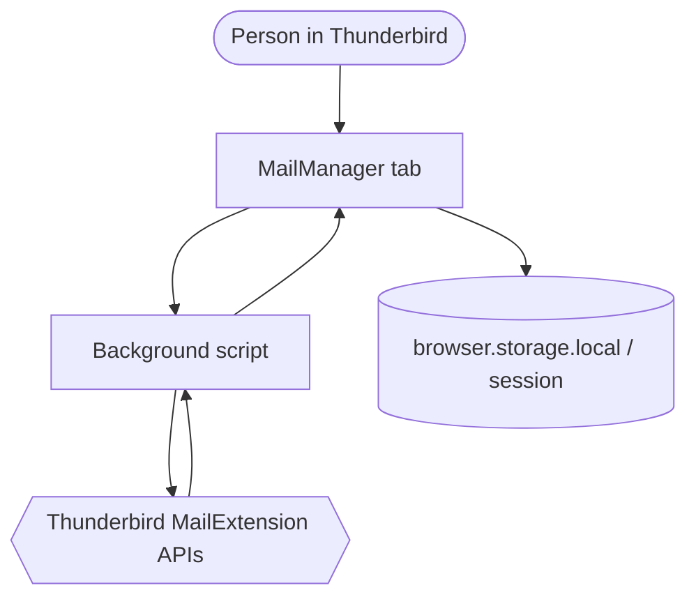

# MailManager


MailManager is a local Thunderbird add-on for reviewing and cleaning up large mailboxes. It scans selected folders, groups messages by sender or domain, and lets you inspect the selection before anything happens. The add-on stays inside your Thunderbird profile: no separate server, no cloud sync, no tracking, and no telemetry.

> **Status: beta, version 0.3.0-beta.** Safety features are not a substitute for backups. Back up important mail first, then try the workflow in a non-critical folder. Real Thunderbird integration tests are still outstanding.

## Contents

- [What is MailManager?](#what-is-mailmanager)
- [Why these safeguards exist](#why-these-safeguards-exist)
- [When MailManager is a good fit](#when-mailmanager-is-a-good-fit)
- [Alternatives and limitations](#alternatives-and-limitations)
- [How the workflow works](#how-the-workflow-works)
- [Architecture and project map](#architecture-and-project-map)
- [Installation and development](#installation-and-development)
- [Permissions, privacy, and license](#permissions-privacy-and-license)

## What is MailManager?

MailManager helps you clean up mail; it does not delete mail automatically. A scan reads message metadata from Thunderbird and turns it into sender and domain groups. For each group, the interface shows the message count, size, read rate, oldest and newest message, and sample subjects. You can expand a group, inspect individual messages, and choose exactly what to act on.

### What the interface provides

- **Source selection and scan profiles:** one account, one folder, or every non-system folder; full scan, mail older than one year, newsletters/bulk mail, unread mail, or cleanup candidates.
- **Three-column workspace:** filters in the sidebar, a sender list in the middle, and a detail panel for the selected sender.
- **Sender and domain views:** compare senders or group related domains; sort by cleanup score, count, size, age, activity, or A–Z.
- **Smart Cleanup dashboard:** “Cleanup suggestions” cards highlight newsletter/bulk mail, storage-heavy senders, and senders inactive for more than two years; each card can filter or select its matches.
- **Filters and candidate review:** the sidebar groups quick filters under View, Recommended, Criteria, and Unsubscribe. Filter pills narrow the list; full-width action buttons check unsubscribe links and start bulk unsubscribe. Advanced filters can combine size, age/activity, and read status.
- **Message review:** expand a sender into message rows, loaded newest first in pages of 50. The inline preview extracts a short plain-text excerpt; attachments can be opened or saved.
- **Actions:** move a selection to Trash or to an existing or new folder, mark it as read, apply Thunderbird tags, check unsubscribe information, or export scan data as CSV or JSON. Select multiple senders and unsubscribe in one step: `https:` links open in the browser and `mailto:` links open prefilled compose windows.
- **Local administration:** cleanup rules, a protection list, action log, diagnostics view, visible columns, and custom regular-expression rules for labels.
- **Interaction:** context menus, keyboard navigation in expanded message lists, shift-click range selection, and drag and drop to a destination folder.
- **Appearance and languages:** light and dark color schemes, SVG interface icons, and German, English, and Russian translations through the shared `_()` function.

### Cleanup score and bulk detection

The cleanup score runs from 0 to 100. It is a prompt to review a group, not a spam or security verdict. It weighs mail volume, unread rate, and inactivity. A high score means the group is probably worth a closer look; it never means the group is safe to delete.

Bulk detection looks for common newsletter and marketing patterns in addresses, display names, and sample subjects. It can also check `List-Unsubscribe` headers on demand. Pattern matching ignores diacritics, so `ä` and `a`, or `ß` and `ss`, are treated alike. Custom regular-expression rules can label additional patterns such as `amazon|ebay`.

## Why these safeguards exist

Cleaning up a mailbox has an awkward property: one match can mean hundreds of messages, and a bad selection can be hard to spot. MailManager therefore keeps analysis, preview, and action separate.

### Before an action

- System folders such as Sent, Drafts, Archive, Trash, Spam/Junk, and Outbox are not offered as scan targets.
- Protected senders and protected source folders are checked again in the background before Trash, move, archive, or tag actions. If reliable folder data is unavailable, the action fails rather than guessing.
- The Trash dialog calculates the count, size, and messages excluded by rules in advance. Changing a rule locks confirmation until a fresh preview is available.
- Warnings cover very recent mail, personal senders, small groups, mostly read selections, large volumes, and mixed domains. High warning levels require another confirmation.
- Saved rules can restrict candidates to older mail and keep the newest *N* messages per sender.
- The normal cleanup flow moves messages to Trash. There is no publicly reachable permanent-delete action, and the add-on does not request the `messagesDelete` permission.
- Undo works only when Thunderbird returns new message IDs after a move. For tags and read status, it restores the saved state; undo entries are separate for each MailManager tab.
- CSV export escapes quotation marks and neutralizes formula prefixes in sender fields, so spreadsheet software does not execute them as formulas.

### Why local processing?

The sensitive part of a mailbox is not just the message body. Senders, subjects, sizes, and timestamps reveal plenty on their own. MailManager processes this data inside Thunderbird. `browser.storage.local` stores only MailManager data such as rules, the protection list, the log, and UI settings. The scan cache lives in `browser.storage.session`, so restarting Thunderbird requires a new scan. Export files are created only after you explicitly export them.

An `https:` unsubscribe URL opens in the default browser only after confirmation. For `mailto:`, MailManager opens only a prefilled Thunderbird compose window.

## When MailManager is a good fit

MailManager fits a mailbox that has grown over years and needs a reviewable way to narrow the selection: checking newsletters, finding inactive senders, comparing storage use, or moving old mail to Trash under clear rules.

### How the workflow works

1. Choose an account, a folder, or all non-system folders, then select a scan profile.
2. Start the scan and narrow candidates with search, sorting, quick filters, or the dashboard.
3. Expand questionable senders, inspect individual messages in the preview or Thunderbird, and protect important senders.
4. Send the selection to the Trash dialog. Set rules such as "older than 365 days" and "keep the latest 5."
5. Review the calculated preview and safety warnings. Recalculate the preview after any change.
6. Only then confirm, check the result and action log, and undo immediately if it is available.

Protection suggestions consider personal senders, recently active or small sender groups, and a high read rate. They are suggestions, not automatic classification.

### When not to use it

- Do not use it as a replacement for backups or your own archiving strategy.
- Do not use it for unattended mass deletion. The score, bulk detection, and `List-Unsubscribe` are heuristic and can be wrong.
- A locally built XPI with the permanent ID in `manifest.json` can be installed directly through Thunderbird's Add-ons Manager. Publication and review through [addons.thunderbird.net](https://addons.thunderbird.net) is needed for public distribution.
- Do not treat it as a complete mail client. Reading full messages, editing, and replying remain Thunderbird's job.

## Alternatives and limitations

| Need | MailManager | Alternative |
|---|---|---|
| Remove a few messages one by one | Groups messages and lets you review the selection before acting | Delete or move them directly in Thunderbird |
| Avoid future newsletters | Finds possible bulk senders and `List-Unsubscribe` | Unsubscribe with the sender or use Thunderbird filters |
| Keep old messages permanently | Can move them into a folder | Thunderbird archiving or dedicated IMAP archive folders |
| Empty a mailbox without review | Not what the normal cleanup flow is for | Only after a backup, using the appropriate Thunderbird feature |
| Installable long-term add-on | Install a locally built XPI with its permanent ID through Add-ons Manager | Use [addons.thunderbird.net](https://addons.thunderbird.net/) for public distribution |

Known limitations:

- Thunderbird can change message IDs during a move, so undo reliability depends on the IDs Thunderbird returns.
- The inline preview shows only a shortened plain-text excerpt. HTML is simplified only as a fallback; it is not rendered as a full message.
- Unsubscribe checks run only when needed, so a regular scan does not read more than necessary.
- Scan, move, undo, preview, unsubscribe, and attachment flows still need testing in a running Thunderbird instance.

## Architecture and project map

### How the pieces fit together



1. The toolbar button opens `tab/tab.html` in its own Thunderbird tab.
2. `tab/tab.js` requests accounts and folders, starts scans, and keeps the UI state for the current view.
3. `background/background.js` talks to Thunderbird APIs, reads folders and messages, checks protection boundaries, and performs confirmed actions.
4. Testable functions in `shared/` calculate scores, normalize domains, format exports, and extract preview text.
5. The tab displays results, previews, and warnings. Only a valid preview enables Trash confirmation.

### Key files

| Path | Purpose |
|---|---|
| [`mailmanager/manifest.json`](mailmanager/manifest.json) | Manifest V3, permanent extension UUID, author, SVG/PNG icons, Thunderbird 150.0 minimum version, permissions, and background entry point |
| [`mailmanager/background/background.js`](mailmanager/background/background.js) | Message router, folder and scan interface, protection checks, actions, and undo |
| [`mailmanager/tab/tab.js`](mailmanager/tab/tab.js) | UI state, rendering, filters, selection, dialogs, and action creation |
| [`mailmanager/shared/cleanup-logic.mjs`](mailmanager/shared/cleanup-logic.mjs) | Cleanup and bulk scores, domain normalization, protection suggestions, and rule suggestions |
| [`mailmanager/shared/message-preview.mjs`](mailmanager/shared/message-preview.mjs) | Limited plain-text excerpt from a Thunderbird message structure |
| [`mailmanager/shared/utils.js`](mailmanager/shared/utils.js) | Author parsing, display formatting, and CSV and JSON export |
| [`mailmanager/tests/`](mailmanager/tests/) | Node.js tests for logic, previews, UI helpers, and background protection boundaries |

For more detail on interaction, permanent installation, and keyboard controls, see [`mailmanager/README.md`](mailmanager/README.md). Changes are listed in [`CHANGELOG.md`](CHANGELOG.md).

## Installation and development

### Prerequisites

- Thunderbird **150.0 or later**
- Node.js **20** for tests and package builds; it is not needed to run the add-on
- `zip` for `npm run build`

### Load temporarily for development

```text
Thunderbird → ≡ → Add-ons and Themes → Extensions
→ ⚙ → Debug Add-ons → Load Temporary Add-on…
→ Select mailmanager/manifest.json
```

After making changes, select **Reload** in the debugging view. Thunderbird removes temporary add-ons when it closes.

### Check and build

```bash
git clone https://github.com/mrAibo/Mail_Manager.git
cd Mail_Manager/mailmanager
npm run check     # syntax checks and 83 unit tests
npm run build     # creates ../mailmanager.xpi
```

[`mailmanager.xpi`](mailmanager.xpi) in the repository root is the canonical package artifact. [`dist/mailmanager.xpi`](dist/mailmanager.xpi) is the tracked copy. The build excludes tests, `node_modules`, `package.json`, and the nested README. CI runs `npm run check`, builds the XPI, verifies it with `unzip -t`, and uploads `mailmanager.xpi` as a build artifact.

A permanently installable XPI requires a permanent extension ID (set in `manifest.json`). Thunderbird does not require Mozilla signing for local installation — a locally built XPI with a permanent ID can be installed via the Add-ons Manager. For public distribution through [addons.thunderbird.net](https://addons.thunderbird.net/), the XPI will be signed automatically upon submission.

### Test coverage

```bash
cd mailmanager
npm test
node --check tab/tab.js
```

The tests cover scoring, bulk detection, domains, filters, export, and preview logic, plus background protection boundaries with mocked Thunderbird APIs. The current run includes **83 tests in 5 test files**.

## Permissions, privacy, and license

| Permission | Purpose |
|---|---|
| `accountsRead` | Read accounts and folders |
| `accountsFolders` | Create destination folders |
| `messagesRead` | Read message metadata, previews, and attachments |
| `messagesMove` | Move messages to Trash or folders |
| `messagesUpdate` | Mark messages as read |
| `messagesTags` | Read and set Thunderbird tags |
| `compose` | Open a reply or unsubscribe draft |
| `storage` | Store rules, protection list, log, cache, and UI settings |

The add-on does not request address-book, calendar, or network permissions. MailManager never sends mail automatically or transfers mail contents to its own services.

## License

[MIT](LICENSE) © 2026 Aleksej Voronin.
